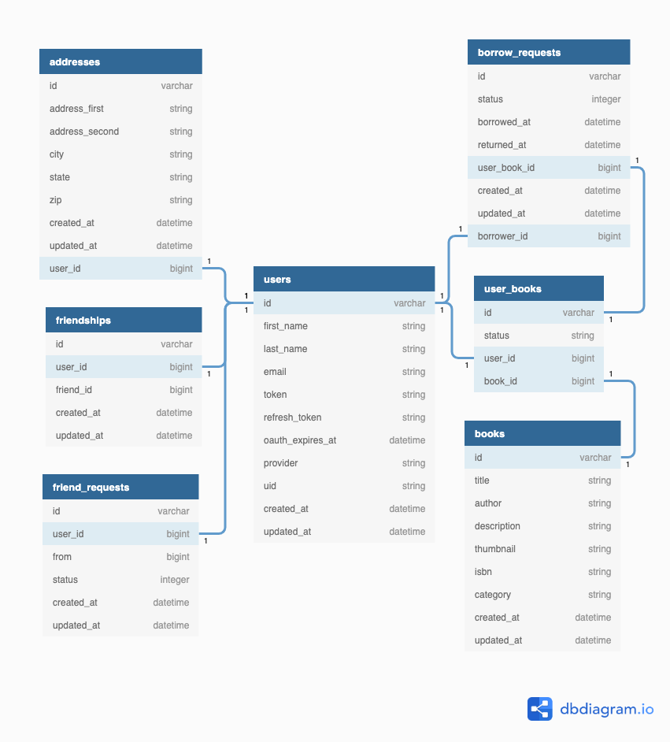

# ShelfShare

  <!-- TO DO: Add screenshots for about, dashboard, books, and profile. Once we create a demo video, link that below Logo in the "view Demo" link, as well as in the demonstration link under the Usage section. Check verbiage. Remove logo photo? Add more resources to the acknowledgements section. -->


<!-- PROJECT SHIELDS -->
[![Contributors][contributors-shield]][contributors-url]
[![Forks][forks-shield]][forks-url]
[![Stargazers][stars-shield]][stars-url]
[![Issues][issues-shield]][issues-url]


<!-- PROJECT LOGO photo -->
<br />
<p align="center">
  <a href="https://github.com/Shelf-Share-BEE-Mod3">
    
  </a>

  <h3 align="center">Shelf Share</h3>

  <p align="center">
    ShelfShare is a platform for sharing books via mail.
You can borrow and lend books with your friends!
    <br />
    <a href="https://github.com/Shelf-Share-BEE-Mod3"><strong>Explore the docs »</strong></a>
    <br />
    <br />
    <a href="Add our video link here">View Demo</a>
    ·
    <a href="https://github.com/Shelf-Share-BEE-Mod3/shelf-share-rails/issues">Report Bug</a>
    ·
    <a href="https://github.com/Shelf-Share-BEE-Mod3/shelf-share-rails/issues">Request Feature</a>
  </p>
</p>


<!-- TABLE OF CONTENTS -->
## Table of Contents

* [About the Project](#about-the-project)
  * [Built With](#built-with)
* [Getting Started](#getting-started)
  * [Prerequisites](#prerequisites)
  * [Installation](#installation)
* [Usage](#usage)
* [Roadmap](#roadmap)
* [Contributing](#contributing)
* [License](#license)
* [Contact](#contact)
* [Acknowledgements](#acknowledgements)


<!-- ABOUT THE PROJECT -->
## About The Project

[![about-screenshot][about-screenshot]](https://example.com)

ShelfShare wants to help you save money by allowing you to borrow and lend out books you own to your friends. We put those dusty books in your collection to use!

Here's why:
* Most of us are guilty of buying that book we "have to have" just to read it once and stash it on a shelf somewhere.
* Save money! Shelf share is a free service. Once you find a book you are interested in on a friend's shelf, request to borrow the book, pay for shipping, and you are ready to go!
* Convenience. ShelfShare is simplistic in design, no walking around the library trying to find a book. Simply look through the books that your friends own and request a book! Easy!  :smile:


A list of commonly used resources and references that our team found helpful in the creation of this project are listed in acknowledgements.

### Built With
* [Sinatra](https://github.com/sinatra/sinatra)
* [Rails](https://github.com/rails/rails)
* [Ruby](https://github.com/ruby/ruby)


<!-- GETTING STARTED -->
## Getting Started

To use ShelfShare locally, you can fork or clone [these](https://github.com/Shelf-Share-BEE-Mod3) two repos.
The **ShelfShare Web App** is the application itself, while **BookBuddy** is the micro-service we will be using to find the book information we need to add books to our shelf!

### Prerequisites

Below are the commands you will need to run in your terminal once you are inside the shelf share directory. You will need to run the following commands inside the book buddy service as well.

Ruby version 2.5.3

Rails version 5.2.4.4

* Bundle Install
```ruby
bundle exec install
```
* Set up Database
```ruby
rake db:create
rake db:migrate
```

### Schema
After running your migrations, your schema will look something like this!
<br />
<p align="center">
    
  </a>

### Installation

1. Get a free Google Developer API Key [here](https://console.developers.google.com/)
2. Clone the repos if you have not already
* Shelf Share
```sh
git clone git@github.com:Shelf-Share-BEE-Mod3/shelf-share-rails.git
```
* Book Buddy
```sh
git clone https://github.com/Shelf-Share-BEE-Mod3/book_buddy.git
```
3. Install Gems
```ruby
bundle exec install
```
```ruby
bundle exec figaro install
```
4. Add your both your google client id and google client secret key in `application.yml`
```ruby
GOOGLE_CLIENT_ID: = 'ENTER IN YOUR API KEY'
GOOGLE_CLIENT_SECRET: 'ENTER IN YOUR SECRET API KEY'
```


<!-- USAGE EXAMPLES -->
## Usage
Run ```rails s``` in your terminal and navigate to ```http://localhost:3000/``` in your local browser.

Once you sign in with Google, you will be asked to allow Shelf Share access to your Google Books. This will only be triggered the first time you log in.

Your **Dashboard** is a convenient place to view all the books you have borrowed or lent out, as well as new friend and book requests.
[![dashboard-screenshot][dashboard-screenshot]](https://example.com)

The **Books** tab is where you will go to find the books your friends own.
[![books-screenshot][books-screenshot]](https://example.com)

To add books that you own to your shelf, navigate to the **Profile** tab, where you will see buttons to add books to your shelf, update your address, and view the books you have already added to your shelf!
[![profile-screenshot][profile-screenshot]](https://example.com)

_For more examples, please refer to this demonstration [Documentation](Enter Video Link HERE!)_


<!-- ROADMAP -->
## Roadmap

See the [open issues](https://github.com/Shelf-Share-BEE-Mod3/shelf-share-rails/issues) for a list of proposed features and known issues.


<!-- CONTRIBUTING -->
## Contributing

Contributions are what make this community such an amazing and fun place to learn, grow, and create! Any contributions you make are **greatly appreciated**.

1. Fork the Project
2. Create your Feature Branch ```git checkout -b feature/NewGreatFeature```
3. Commit your Changes ```git commit -m 'Add some NewGreatFeature'```
4. Push to the Branch ```git push origin feature/NewGreatFeature```
5. Open a new Pull Request!


<!-- LICENSE -->
## License

DISCLAIMER: 
The ShelfShare platform is a proof-of-concept and not likely to be maintained over time. Thus, any address information submitted will remain in our database indefinitely unless you delete it.
 For concerns regarding your privacy, please do not submit any real location information to this website.


<!-- CONTACT -->
## Contact

Phillip S - [![LinkedIn][linkedin-shield]](https://www.linkedin.com/in/phillipstrom/) - [GitHub](https://github.com/Strompy) - [Email](phillip.strom@gmail.com)

AJ Tran - [![LinkedIn][linkedin-shield]](https://www.linkedin.com/in/ajtran-dev/) - [GitHub](https://github.com/ajtran303) - [Email](anh.jamietran@gmail.com)

Lito White - [![LinkedIn][linkedin-shield]](https://www.linkedin.com/in/litowhite/) - [GitHub](https://github.com/ljwhite) - [Email](leland.white@gmail.com)

Jonathan Wilson - [![LinkedIn][linkedin-shield]](www.linkedin.com/in/jonathan--wilson) - [GitHub](https://github.com/Jonathan-M-Wilson) - [Email](jonathanmorrillwilson@gmail.com)

Project Link: [ShelfShare](https://github.com/Shelf-Share-BEE-Mod3)


<!-- ACKNOWLEDGEMENTS -->
## Acknowledgements
<!-- Add resources that were used to help create this project here -->
* [Google Books API Docs](https://developers.google.com/books/docs/v1/using)


<!-- MARKDOWN LINKS & IMAGES -->
[contributors-shield]: https://img.shields.io/github/contributors/othneildrew/Best-README-Template.svg?style=flat-square
[contributors-url]: https://github.com/Shelf-Share-BEE-Mod3/shelf-share-rails/graphs/contributors
[forks-shield]: https://img.shields.io/github/forks/Shelf-Share-BEE-Mod3/shelf-share-rails.svg?style=flat-square
[forks-url]: https://github.com/Shelf-Share-BEE-Mod3/shelf-share-rails/network/members
[stars-shield]: https://img.shields.io/github/stars/Shelf-Share-BEE-Mod3/shelf-share-rails.svg?style=flat-square
[stars-url]: https://github.com/Shelf-Share-BEE-Mod3/shelf-share-rails/stargazers
[issues-shield]: https://img.shields.io/github/issues/Shelf-Share-BEE-Mod3/shelf-share-rails.svg?style=flat-square
[issues-url]: https://github.com/Shelf-Share-BEE-Mod3/shelf-share-rails/issues
[license-shield]: https://img.shields.io/github/license/Shelf-Share-BEE-Mod3/shelf-share-rails.svg?style=flat-square
[license-url]: https://github.com/Shelf-Share-BEE-Mod3/shelf-share-rails/blob/master/LICENSE.txt
[linkedin-shield]: https://img.shields.io/badge/-LinkedIn-black.svg?style=flat-square&logo=linkedin&colorB=555
[about-screenshot]: images/screenshot.png
[dashboard-screenshot]: images/screenshot.png
[books-screenshot]: images/screenshot.png
[profile-screenshot]: images/screenshot.png
